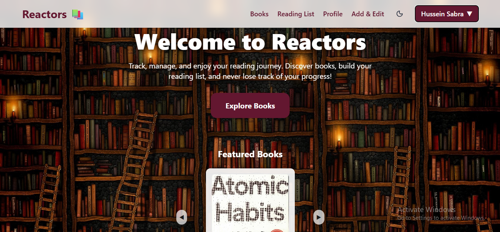
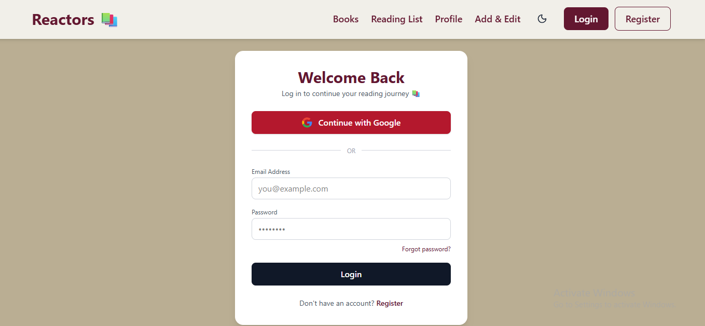
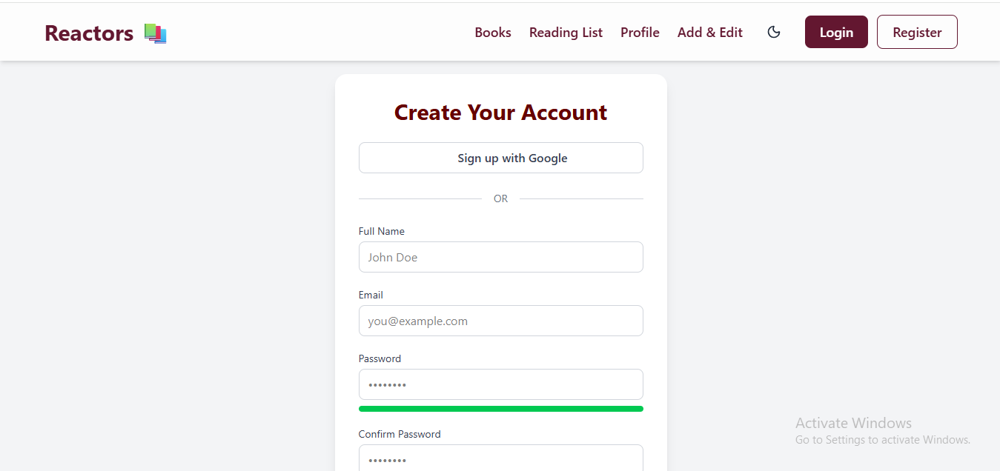
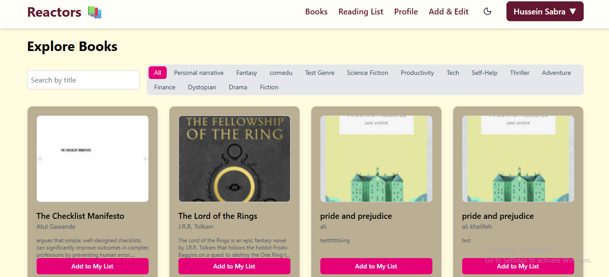
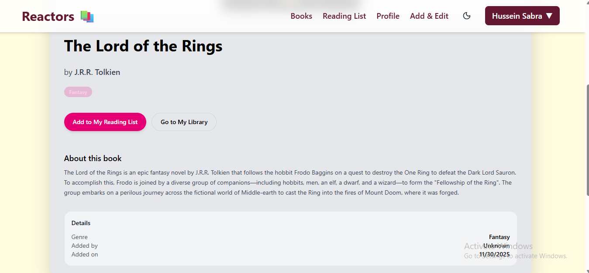
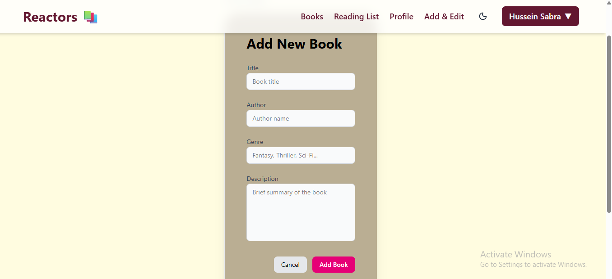
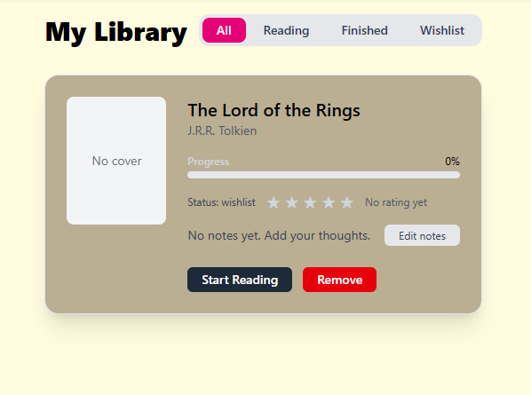
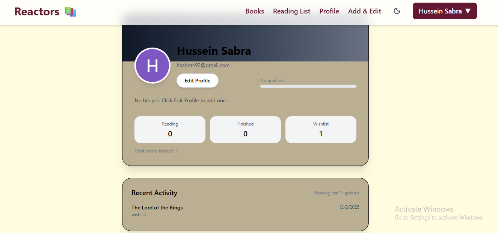
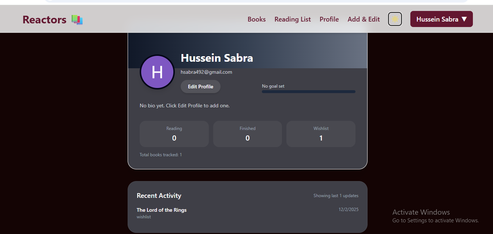
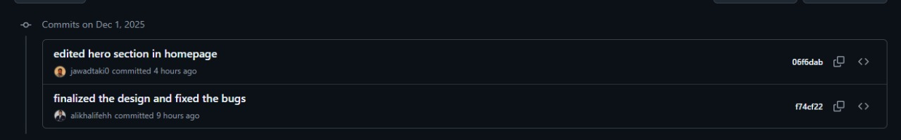

# Reactors — Book Management Web App

A modern and intuitive platform for browsing, tracking, and managing books.  
Built with **React + Vite + TailwindCSS**, emphasizing speed, simplicity, and smooth UI/UX.

---

---

# Team Members

| Name | Responsibilities |
|------|------------------|
| **Ali Khalifeh** | Homepage, Add Book, Edit Book, Dark Mode |
| **Jawad Taki** | Login, Register |
| **Hussein Sabra** | Book Listing, Book Details |
| **Ali Daouk** | Profile Page, Reading List |

---

# Overview

Reactors is a responsive book management web app where users can:

- Browse a curated collection of books  
- View detailed information about each book  
- Add or edit books via a clean interface  
- Maintain a personal reading list  
- Track reading progress  
- Manage profile details  
- Log in or register

This version uses **local mock data** and **React Context** to simulate backend behavior.

---

# Primary Data Entities

### **Book**
Represents each book with attributes like:
- title  
- author  
- year  
- genre  
- description  
- cover image  
- id  

Stored in:
```
src/data/books.js
```

### **User**
Represents user information for login and profile pages.

### **Reading List Entry**
Simulates user's reading progress and book tracking.

---

# Features

### Book Browsing
- View all books with covers, titles, and genres.

### Book Details Page
- Full description  
- Metadata  
- Buttons to edit or add to reading list  

### Add Books
- Simple form with validation  
- Auto-updates the mock database  

### Edit Books
- Modify any book's details  
- Reflects updates immediately  

### Reading List (Wishlist / Reading / Finished)
- Track reading progress  
- Quick visual overview  

### Profile Page
- User info  
- Reading statistics  

### Login & Register (Mock)
- Client-side form validation  
- Simulated authentication flow  

### Modern Home Page
- Hero section  
- Carousel  
- Featured books  

### UI / UX
- Tailwind for styling  
- Framer Motion for animations  
- Fully responsive  

---

# Tech Stack

- **React 18**
- **Vite**
- **TailwindCSS**
- **React Router DOM**
- **Framer Motion**
- **Local/Session Storage**
- **Context API**

---

# Project Structure

```
src/
 ├── assets/            # Images and static files
 ├── components/        # UI components
 ├── context/           # BookContext (mock backend simulation)
 ├── data/              # Mock data (books.js)
 ├── pages/             # Application pages
 ├── App.jsx            # App root + routing
 └── main.jsx           # Vite entry point
```

---

# Mock Data Architecture

### `src/data/books.js`
Acts as a **local database**.

Example:
```js
{
  id: 1,
  title: "Atomic Habits",
  author: "James Clear",
  year: 2018,
  genre: "Self-help",
  description: "...",
  cover: "/covers/atomic.jpg"
}
```

### `src/context/BookContext.jsx`
Simulates backend API:

- `getBooks()`
- `getBookById()`
- `addBook()`
- `updateBook()`
- `deleteBook()`

This makes the entire app behave like a real full-stack project without needing an API.

---

# Setup Instructions

### 1️. Clone the Repository  
```
git clone https://github.com/alikhalifehh/Reactors.git
```

### 2️. Navigate to the Project  
```
cd Reactors
```

### 3️. Install Dependencies  
```
npm install
```

### 4️. Run the Development Server  
```
npm run dev
```

App runs at:
```
http://localhost:5173
```

---

# Screenshots

### Home Page  


### Login Page  


### Register Page  


### Books Listing  


### Book Details  


### Add Book  


### Reading List  


### Profile Page  


### Dark Mode





---

# Phase 2 — Full Stack Integration (Frontend + Backend)

The frontend was connected to a real backend API.

Authentication now uses backend endpoints.

Books and reading list entries are stored in MongoDB.

All CRUD operations communicate with the backend through real API endpoints.

The app now behaves like a full production-ready system. 

---

# Conclusion

Reactors demonstrates:

- Clean React architecture  
- Component-based design  
- Smooth UI/UX  
- Team collaboration  
- Simulated full-stack behavior (Phase1)
- Connected to Backend (Phase 2)
